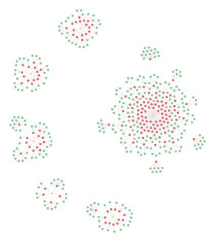
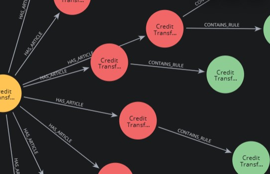
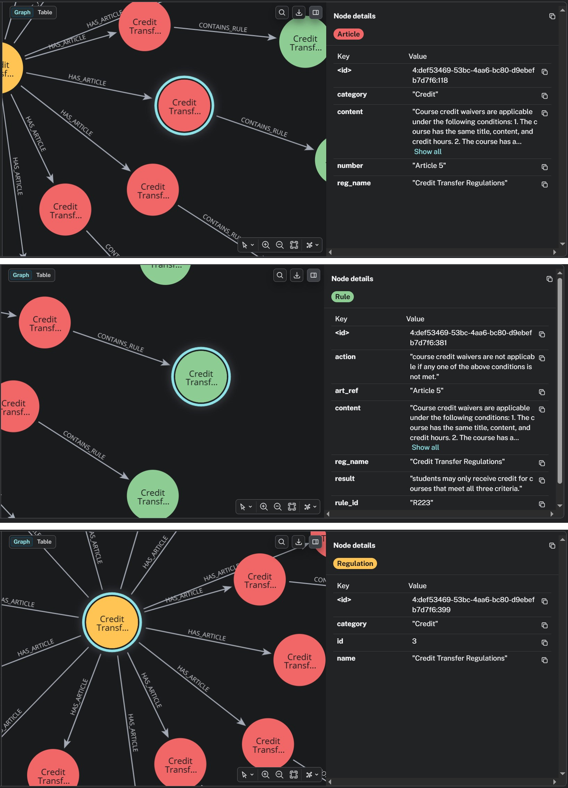

**Assignment 4: KG-based QA for NCU Regulations**

**114522101 梅慈慧**

1.  **KG Construction Logic and Design Choices**

The knowledge graph is constructed through a pipeline that transforms raw regulatory documents into a structured graph database in Neo4j. Raw PDFs are first parsed and stored in the SQLite database (ncu_regulations.db). This database contains two core tables, regulations table that stores regulation metadata such as ID, name, and category and an articles table that stores each regulation article with its content and associated regulation ID.

The knowledge graph is constructed in thre hierarchical layers, which are the regulation layer, article layer and rule layer. Each regulation is represented as a node that contains regulation ID, name and category. Each article is represented as node that contains article number, full content, regulation name and category. For each article, we use LLM (here I use Qwen/Qwen2.5-1.5B-Instruct) to extract structured rules in JSON format. The extraction prompt is structured as a two-message chat template, with a system message that defines the expected output format and instructs the model to return only JSON, and a user message (containing the article number, regulation name, and truncated content). The model is instructed to return a list of rules where each rule has three fields: type (exactly one of requirement, penalty, prohibition, or general), action (the situation or condition described), and result (the consequence or outcome). The model\'s raw output is then searched for the first occurrence of \"{\" and the last occurrence of \"}\" to extract the JSON substring, which is then parsed.

As mentioned before, local LLM is used to extract rules from each article. To reduce computational costs, only the first 500 characters of each article are passed to LLM. If the model fails to produce valid JSON or returns an empty rules list, a fallback mechanism is triggered. In this case, the article is split into sentences, and each sentence longer than a maximum number of characters (I used 20) is converted into a general type of rule. This ensures that every article contributes at least one rule to the knowledge graph.

To further improve reliability, rules with similar action text within the same article are removed to prevent redundancy. We also use fallback rule generation to ensure no article is missing from the graph. The rule also stores the full original article content to ensure retrieval always has access to complete context even if the extracted part is incomplete. After using these rules, the final knowledge graph achieves full coverage (159/159).

2.  **KG Schema and Diagram**

The knowledge graph follows a strict hierarchical structure: Regulation, Article, Rule. A Regulation node is connected to multiple Article nodes through HAS_ARTICLE directed relationships, and each Article node is connected to multiple Rule nodes through CONTAINS_RULE. Each node type carries a fixed set of properties. Regulation nodes store id, name, and category. Article nodes store number, content, reg_name, and category. Rule nodes store rule_id (globally unique identifier), type, action, result, art_ref, reg_name, and content (the full original article text). The reg_name and category properties are intentionally denormalized onto Article and Rule nodes. This allows rule-level query results to carry full context on their own without requiring additional hops, which simplifies retrieval queries and improves performance. The full article content is also stored on every Rule node for the same reason. Since each Rule is the unit returned during retrieval, having the complete article text directly on the node means the answer generation step never needs to traverse back to the Article node.

There are two indexes on the graph, article_content_idx, and rule_idx. The first one is defined on the content property of Article nodes and supports broad document-level search. The second one is defined on Rule nodes for fine-grained rule-level search. Having the full article content indexed within rule_idx means a single index lookup can match against both the LLM-extracted structured fields and the original regulatory text, which improves recall.

The graph forms multiple independent clusters when visualized in Neo4j, where each cluster corresponds to one regulation document. Within each cluster, articles branch into multiple rule nodes, forming a tree-like structure. This design supports fine-grained retrieval while preserving document-level organization. To visualize the KG in Neo4j, I used this query:

$$MATCH\ p = (reg:Regulation) - \left\lbrack :{HAS}_{ARTICLE} \right\rbrack \rightarrow (a:Article) - \left\lbrack :{CONTAINS}_{RULE} \right\rbrack \rightarrow (r:Rule)$$

$$RETURN\ p$$

{width="5.892828083989501in" height="2.414850174978128in"}{width="5.892828083989501in" height="2.414850174978128in"}
From the figure above, we can see 6 clusters, one per document. The core node (yellow) is the regulation, the red nodes are the article, and green nodes are the rule. The final graph contains 6 Regulation nodes, 159 Article nodes, and 322 Rule nodes, all correctly connected with no orphaned nodes.
{width="5.0in" height="25"}

3.  **Key Cypher query design and retrieval strategy**

The retrieval pipeline consists of four sequential steps: entity extraction, Cypher query construction, dual-stage retrieval, and hybrid reranking.

In the entity extraction step, the question is analyzed using keyword matching to infer one of four question types: prohibition, penalty, requirement, or general. Prohibition is checked first to avoid misclassification with requirement-type questions. Stop words are removed and remaining words longer than 2 characters form the initial subject terms. These terms are then expanded based on the question\'s inferred intent to account for vocabulary mismatch between the question phrasing and the regulation text, with the final list duplicated while preserving order.

In the query construction step, subject terms are joined with OR operators into a keyword string and sanitized by removing reserved Lucene characters. Two Cypher queries are then built from this keyword string. The typed query searches the rule_idx index and, when the question type is not general, adds a WHERE clause to filter results by the inferred type, returning up to 10 results. The broad query searches the article_content_idx index at the article level and traverses CONTAINS_RULE to reach Rule nodes, returning up to 5 results. This broad query acts as a fallback for cases where the relevant information exists in the article text but was not captured precisely by the LLM extraction. Both queries return the same fields ordered by score descending.

Both queries run sequentially in the same Neo4j session. The typed query runs first, then the broad query fills in any rules not already seen, avoiding duplicates across both stages. The retrieved candidates are then reranked using four signals. The dominant signal is semantic similarity, computed using the all-MiniLM-L6-v2 sentence transformer between the question and each candidate\'s combined action, result, and article content. I also consider the keyword overlap and the type match. The original Neo4j score is also included as a minor factor. All four are summed and candidates are sorted by the final score.

Before calling the LLM, the system first tries to extract the answer directly from the top candidates. For numeric questions, a regex looks for a number followed by a time or quantity unit and returns it with the source cited. For permission questions, negation phrases are checked before affirmation phrases to avoid wrong yes answers. Only when neither approach works does the system send the top 3 rules as evidence to the LLM, asking it to pick the most relevant one and give a short answer with the source cited.

4.  **Key Cypher query design and retrieval strategy**

During development, I encountered several issues. These problems were analyzed and resolved iteratively, with a final performance of 19/20 correct answers, with only one remaining failure.

The initial issue was incorrect tule type extraction, where almost all rule nodes had invalid type values such as requirement\|penalty\|prohibition\|general instead of a single category. This is caused by the LLM just copying the example format instead of selecting one type. Since the KG relies on the type of field for filtering and reranking, this reduced retrieval accuracy. To fix this, the prompt was made stricter by explicitly requiring the model to choose exactly one type from the predefined set. Additionally, I added fallback mechanism. Even when extraction failed, the fallback mechanism ensured that rules were still generated, so overall coverage remained 100%. The second issue is extremely slow LLM inference. I initially chose Qwen/Qwen2.5-3B-Instruct, but it is extremely slow on CPU. To let the model perform faster, I set small generation limit but found out that this caused truncated JSON outputs. I then switch to smaller local model and allow more token output for structured JSON. After this, the inference became more stable and faster.

I also observe that for some questions about numeric, the correct article was retrieved, but it generates answer using wrong number. This might be because of articles containing multiple numbers and the LLM has weak reasoning. To solve this, I added regex detection for numerical answer, this would be trigger only for duration or time type questions. In other cases, the relevant article was not even retrieved, the root cause was the vocabular mismatch because question and article used different phrasing. To improve this, I added semantic expansion in query preprocessing which improves the recall without using hardcoded specific answer.

Another issue I encountered was lucene query errors where some queries fail due to special characters (e.g. /). To address this, I remove all problematic characters and normalize the strings before searching. Also, in some cases, the keywords "pe" matched inside "penalty", as a result, completely irrelevant articles were ranked highly and producing wrong answers. For this, I use stricter matching to improve the retrieval precision.

The only failed case remains in Q6, where the correct rule was retrieved, but it appears in lower ranked list. The root cause is reranking still prioritized semantic similarity and general overlap. I tried to increase top-k results (from 5 to 10) and improving negation detection by checking negative phrases before positive, but the ranking is still imperfect. For the outcome, the KG coverage is 100% with answer accuracy of 19/20.
